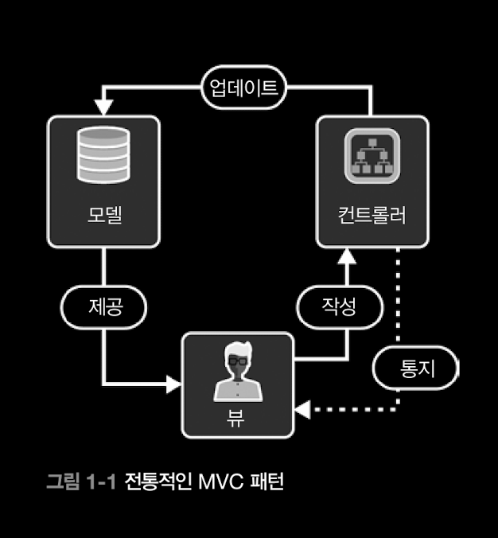
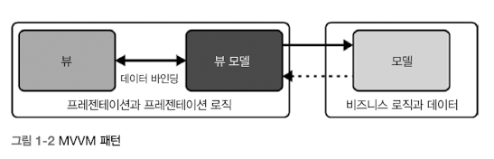
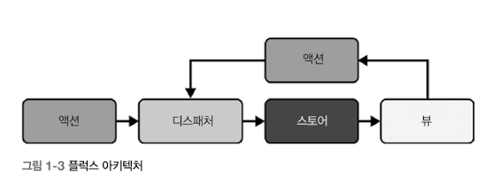

# CHAPTER 01. 입문자를 위한 지식

## 목차

1. [리액트를 만들게 된 동기는 무엇인가요?](#1-리액트를-만들게-된-동기는-무엇인가요)
2. [리액트가 MVC와 MVVM 같은 이전 패턴보다 개선된 점은 무엇인가요?](#2-리액트가-mvc와-mvvm-같은-이전-패턴보다-개선된-점은-무엇인가요)
3. [플럭스 아키텍쳐의 특징은 무엇인가요?](#3-플럭스-아키텍쳐의-특징은-무엇인가요)
4. [선언적 프로그래밍 추상화의 장점은 무엇인가요?](#4-선언적-프로그래밍-추상화의-장점은-무엇인가요)
5. [효율적인 UI 위한 가상 DOM의 역할은 무엇인가요?](#5-효율적인-ui-위한-가상-dom의-역할은-무엇인가요)

## 1. 리액트를 만들게 된 동기는 무엇인가요?

🌈 _업데이트_ 때문이다.

- 웹 초창기에는 정적인 페이지들이 많았지만 웹의 기능이 커지고, 개발이 고도화되면서 사용자들의 니즈를 조금 더 완벽하게 충족시키려는 욕구가 늘어나게 되었다.
- 새 페이지를 열어서 로딩이 되기 까지, 사용자가 기다리지 않고 바로바로 확인하고자 함.
- 즉작적인 업데이트를 대규모로 수행하기에는 한계가 분명해짐

😿 어려웠던 이유

1. _성능_
   웹 페이지를 업데이트하면 브라우저가 페이지의 레이아웃을 다시 계산한다. (`reflow`)<br/>
   다시 계산에서 다시 그려내는 작업을 수행하기 때문에 _병목현상_ 발생!
2. _신뢰성_
   상태를 여러 곳에서 추적해서 일관되게 유지하는 것이 어려움
3. _보안_
   크로스 사이트 스크립팅(XSS), 크로스 사이트 요청 위조(CSRF)와 같은 악용 방지를 위해 페이지에 사용되는 HTML, JS 파일을 모두 소독해야 함.(데이터에 문제가 될 만한 부분을 제거하는 작업)

### ⏳ 리액트 이전의 세계

> 내가 버튼을 결제 버튼을 클릭해서 결제가 되고, 결제된 상태가 내 주문내역에 반영된다고 생각해보자.

이 짧은 한 줄의 문장에 많은 상태들이 고려가 되어야 한다.

| 헤더                  | 상태                                                                |
| --------------------- | ------------------------------------------------------------------- |
| **클릭 전**           | 버튼의 기본 상태 ex. 결제하기                                       |
| **클릭했지만 대기중** | 버튼 클릭됨, 그러나 특정 동작 수행중 ex. 결제중... // 버튼 비활성화 |
| **클릭 후 성공**      | 버튼 클릭되고, 동작 수행 완료 ex. 결제 완료 팝업 뜨고 종료          |
| **클릭 후 실패**      | 버특 클릭되고, 동작 수행 실패 ex. 결제 실패 팝업 뜨고 머무르기      |

<br/>
자, 이제 이 상태에 따라 화면이 바뀌어야 한다.

## 이 과정을 나열해보자.

1️⃣ 호스트 환경(주로 브라우저)에서 `docuemnt.querySelector` or `document.getElementById` 같은 엘리먼트 탐색 API를 사용해 버튼을 찾는다.

2️⃣ 버튼에 이벤트 리스너를 추가해 클릭 이벤트를 추적한다.

3️⃣ 이벤트에 반응해 상태를 업데이트한다.

4️⃣ 페이지에서 벗어날 때 이벤트 리스너를 제거하고 모든 상태를 정리한다.

예시) 좋아요 버튼

````html
<button id="likedButton" data-liked="false">좋아요</button>
<!-- data-like : 클릭 여부를 추적 -->
## 1. 리액트를 만들게 된 동기는 무엇인가요? 🌈 _업데이트_ 때문이다. - 웹
초창기에는 정적인 페이지들이 많았지만 웹의 기능이 커지고, 개발이 고도화되면서
사용자들의 니즈를 조금 더 완벽하게 충족시키려는 욕구가 늘어나게 되었다. - 새
페이지를 열어서 로딩이 되기 까지, 사용자가 기다리지 않고 바로바로 확인하고자 함.
- 즉작적인 업데이트를 대규모로 수행하기에는 한계가 분명해짐 😿 어려웠던 이유 1.
_성능_ 웹 페이지를 업데이트하면 브라우저가 페이지의 레이아웃을 다시 계산한다.
(`reflow`)<br />
다시 계산에서 다시 그려내는 작업을 수행하기 때문에 _병목현상_ 발생! 2. _신뢰성_
상태를 여러 곳에서 추적해서 일관되게 유지하는 것이 어려움 3. _보안_ 크로스
사이트 스크립팅(XSS), 크로스 사이트 요청 위조(CSRF)와 같은 악용 방지를 위해
페이지에 사용되는 HTML, JS 파일을 모두 소독해야 함.(데이터에 문제가 될 만한
부분을 제거하는 작업) ### ⏳ 리액트 이전의 세계 > 내가 버튼을 결제 버튼을
클릭해서 결제가 되고, 결제된 상태가 내 주문내역에 반영된다고 생각해보자. 이 짧은
한 줄의 문장에 많은 상태들이 고려가 되어야 한다. | 헤더 | 상태 | |
--------------------- |
------------------------------------------------------------------- | | **클릭
전** | 버튼의 기본 상태 ex. 결제하기 | | **클릭했지만 대기중** | 버튼 클릭됨,
그러나 특정 동작 수행중 ex. 결제중... // 버튼 비활성화 | | **클릭 후 성공** |
버튼 클릭되고, 동작 수행 완료 ex. 결제 완료 팝업 뜨고 종료 | | **클릭 후 실패**
| 버특 클릭되고, 동작 수행 실패 ex. 결제 실패 팝업 뜨고 머무르기 |

<br />
자, 이제 이 상태에 따라 화면이 바뀌어야 한다. ## 이 과정을 나열해보자. 1️⃣ 호스트
환경(주로 브라우저)에서 `docuemnt.querySelector` or `document.getElementById`
같은 엘리먼트 탐색 API를 사용해 버튼을 찾는다. 2️⃣ 버튼에 이벤트 리스너를 추가해
클릭 이벤트를 추적한다. 3️⃣ 이벤트에 반응해 상태를 업데이트한다. 4️⃣ 페이지에서
벗어날 때 이벤트 리스너를 제거하고 모든 상태를 정리한다. 예시) 좋아요 버튼
```html
<button id="likedButton" data-liked="false">좋아요</button>
<!-- data-like : 클릭 여부를 추적 -->
````

```js
// 사용자가 버튼을 클릭하면 "좋아요 취소" 로 버튼 텍스트를 업데이트
const likedButton = document.getElementById("likedButton");

likedButton.addEventListener("click", () => {
    const liked = likedButton.getAttribute("data-liked") === "true";
    likedButton.setAttribute("data-liked", !liked);
    likedButton.textContent = liked ? "좋아요 취소" : "좋아요";
})

// 실제 DB에 저장되게 하려면 네트워크 통신 사용

likedButton.addEventListener("click", () => {
    var liked = likedButton.getAttribute("data-liked") === "true";

    // 네트워크 통신
    var xhr = new XMLHttpRequest();
    xhr.open("POST", "/like", true);
    xhr.setRequesetHeader("Content-Type", "application/json;charset=UTF-8");

    xhr.onload = function (){
        if (xhr.status >= 200 && xhr.status < 400>) {
            // success
            likedButton.setAttribute("data-liked", !liked);
            likedButton.textContent = liked ? "좋아요 취소" : "좋아요";
        } else {
            console.error("Server returned an error:", xhr.statusText);
        }
    };

    xhr.onerror = function (){
        // 접속 관련 오류가 발생
        console.error("네트워크 오류")
    };

    xhr.send(JSON.stringfy({ liked: !liked }))
});
```

2015년 이후 fetch API 가 나오면서 아래와 같이 개선할 수 있게 되었다.

```js
const likedButton = document.getElementById("liked");

likedButton.addEvenetListener("click", () => {
  const liked = likedButton.getAttributes("data-liked") === "true";

  fetch("/like", {
    method: "POST",
    headers: {
      "Content-Type": "application/json",
    },
    body: JSON.stringfy({
      liked: !liked,
    }),
  })
    .then(() => {
      likedButton.setAttribute("data-liked", !liked);
      likedButton.textContent = liked ? "좋아요 취소" : "좋아요";
    })
    .catch((err) => {
      likedButton.textContent = "실패";
      console.error("Liked Fetch Err:", err);
    });
});
```

이 과정을 보면,
브라우저에서 버튼을 찾고, 이벤트 리스너를 추가하고, 버튼의 텍스트 콘텐츠를 업데이트하고, 엣지 케이스를 고민해야 한다.
나열만 해도 벌써 쉽지 않은 여정이다. 좋아요 버튼 하나를 구현하는 것일뿐인데 말이다.

그 밖에도 웹 페이지가 고도화될 수록 한계점이 분명해지는 걸 볼 수 있다.

1.  <span style="color: lightblue;">오류가 쉽게 생긴다.</span>

- 서로 다른 클라이언트 측 JS에서 쉽제 접근, 변형 가능하다.

2.  <span style="color: lightblue;">예측이 불가하다.</span>

- 다뤄야 할 요소가 HTML, JS 양쪽에 모두 존재한다는 사실은 어느 쪽도 신뢰하기 어렵다고 해석될 수 있다.
- 예를 들어, 특정 엘리먼트의 존재 여부에 의존하게 되면, 계속 업데이트가 되어야 하는 사용자 인터페이스의 동작 안정성을 보장하지 못한다. ->자칫 하면 사이드 이펙트 파티가 될 수 있다.

3.  <span style="color: lightblue;">비효율적이다.</span>

- DOM의 변형은 계산 비용이 비싸다.
- 레이아웃 이동, 리플로우가 발새하면 성능 문제가 발생한다. 사용자의 브라우저 환경에 따라 심각한 문제가 되기도 한다.

## 2. 리액트가 MVC와 MVVM 같은 이전 패턴보다 개선된 점은 무엇인가요?

리액트 이전에 나왔던 여러 자바스크립트 솔루션을 비교해보고 앞서 발생한 문제를 어떻게 해결했는지, 그리고 리액트는 이들과 다른 점이 무엇이닞 비교하면 리액트의 이점에 대해서 조금 더 잘 이해할 수 있을 것이다.

### 🪶 jQUery

```js
$("#likeButton").on("click", function (){
    $(this).prop("disabled", true);
    fetch("/like", {
        method: "POST",
        body: JSON.stringify({ liked: this.text() === "좋아요" }),
     })
     .then(() => {
        this.text(this.text() === "좋아요" ? "좋아요!!" : "좋아요");
    })
     .catch(() => {
        this.text("실패");
    .finally(() => {
        this.prop("disabled", false);
    });
});
```

❌ jQuery의 단점들

- 코드의 어느 곳이든 페이지 구조르 직접적, 전역적으로 수정할 수 있다. -> 치명적인 사이드 이펙트...
- 코드에 인접한 데이터의 상태가 계속 변해서 개발자가 이를 트래킹하면서 이해하고 테스트하기가 매우 힘들다. (상태가 많고 서비스가 복잡해질 수록)
- 브라우저 환경에 크게 의존한다.
- jQuery 파일 크기가 너무 크다. -> 로딩시간이 길다. -> 사용자에게 부정적인 경험을 끼칠 가능성이 크다.

---

### 🦴 [Backbone](https://backbonejs.org/)

- 2010년대 초에 개발됨
- 리액트 이전에, 브라우저와 자바스크립트 간의 _상태 불일치_, _코드 재사용_, _테스트 가능성_ 등을 처음으로 해결한 방법이다.
- MVC 패턴을 사용한다.

#### MVC 패턴



> MVC 패턴은 모델은 데이터의 출처이고, 뷰는 데이터를 소비하고 있는 인터페이스이다.
> Backbone은 모델, 뷰와 함께 작업할 수 있는 편리한 API를 제공하고 모델과 뷰를 연결하는 방법을 제시했다.

📍 모델

- 데이터, 비즈니르 로직 담당

📍 뷰

- 사용자 인터페이스
- 모델이 제공한 데이터를 사용자에게 표시
- 사용자 명령을 컨트롤러로 전송
- 수동적 (데이터를 직접 조작 ❌)

📍 컨트롤러

- 모델과 뷰 사이 중간다리 역할
- 뷰에서는 사용자의 입력을 받아 처리한다.
- 뷰에게 처리 결과를 반환하기도 한다.

| 장점                                                      | 한계점                                                                                         |
| --------------------------------------------------------- | ---------------------------------------------------------------------------------------------- |
| 비즈니스 로직, 사용자 인터페이스, 사용자 입력이 분리된다. | 대화형 요소가 많은 사용자 페이지에서는 이 방식이 오히려 복잡할 수 있다.                        |
| 모듈화, 유지보수성, 확장성                                | 컨트롤러가 늘어나면 상태 변경, UI의 다양한 변화에 미치는 영향을 관리하기가 점점 더 어려워진다. |
| 테스트 용이                                               | 양방향 데이터 바인딩 -> 주의 깊게 사용해야 한다.                                               |

❌ Backbone의 단점들

- 장황한 코드 & 보일러플레이트 : 어플리케이션이 성장할 수록 보일러플레이트도 많아진다.
- 양방향 데이터 부족 : 데이터가 변경되면 DOM 이 자동으로 변경사항을 업데이트하지 않는다. 개발자가 직접 작성하거나 플러그인을 또 활용해야 한다.
- 이벤트 중심 아키텍쳐 : 모델을 업데이트할 때 전체 어플리케이션에서 수많은 이벤트가 발생할 수 있다. 이벤트들을 관리하가 불가능해서 데이터 변경 하나가 어플리케이션에 수많은 영향을 끼칠 수 있다.
- 조합성 부족 : 뷰 중첩 구조가 어렵다. 따라서 복잡한 사용자 인터페이스를 구성하는데 한계가 발생한다.

---

### 🥊 [Knockout](https://knockoutjs.com/)

- 옵저버블(observable), 바인딩(binding)을 작성하는 방법을 제공하는 라이브러리
- 최초의 반응형(reactive) 자바스크립트 라이브러리 중 하나
- **옵저버블(observable)**: 데이터 출처
- **바인딩(binding)**: 데이터 소비, 렌더링하는 사용자 인터페이스
- MVVM 디자인 패턴을 사용한다.

#### MVVM(Model View ViewModel)



> 데이터 바인딩이 중요해진 최신 UI에 맞추어 기존의 MVC 패턴을 발전시킨 패턴이다.
> 컴포넌트나 템플릿 없이 뷰 모델과 이 뷰 모델을 브라우저 요소에 바인딩하는 방법만 존재한다.

📍 모델

- 데이터 및 비즈니스 로직 담당
- 데이터 검색/처리/저장 담당
- 다른 데이터 출처와 통신
- 뷰와 뷰모델을 모름

📍 뷰

- UI
- 사용자에게 정보 표시
- 사용자의 입력 받음
- 수동적, 어플리케이션 로직 포함 ❌
- 데이터 바인딩 메커니즘을 통해 *자동으로 변경사항을 반영*해 선언적으로 뷰 모델에 바인딩 한다.

📍 뷰모델

- 모델과 뷰 사이 다리 역할(컨트롤러와 비슷)
- 뷰에 바인딩할 데이터, 명령 제공
- 명령 패턴으로 사용자 입력 처리
- 모델의 데이터를 뷰에서 쉽게 표시할 수 있는 형식으로 전환

| 장점                                                                          | 한계점                                                                                           |
| ----------------------------------------------------------------------------- | ------------------------------------------------------------------------------------------------ |
| 테스트 가능성 : 뷰에서 뷰 모델을 분리함으로써 UI 없이 로직만 테스트 가능하다. | 옵저버블을 명시적으로 구독, 변경에 따라 사용자 인터페이스를 업데이트하려면 많은 작업이 필요하다. |
| 유지보성, 재사용성                                                            | 이따금 뷰 모델이 거대해지고 복잡해져 리팩토링과 최적화가 불확실해진다.                           |
| 데이터 바인딩 : UI 업데이트에 필요한 보일러 플레이트 코드이 양이 줄어든다.    |                                                                                                  |

### 🌐 **리액트의 등장!**

> 핵심 아이디어 : <u>컴포넌트 기반 아키텍쳐</u><br/>
> → 재사용 가능한 컴포넌트를 조합하는 것이 가장 최적화된 방법이다.

📍 선언적 코드

- 우리가 보고자 하는 것을 코드로 표현하는 방법을 제공하고, 실제로 어떻게 할지는 리액트가 알아서 한다.
- 이게 무슨 말이냐면, 예를 들어 리스트에 아이템을 추가한다고 생각해보자.

  (i) `html`, `javascript`를 사용하여 작성하는 경우.

  - list에 아이템을 추가하는 과정을 상세히 기술해야 한다. (명령형 코드)
  - HTML에 접근해서 추가할 요소와 추가되어야 할 영역을 찾고 (식별자를 읽고 구별)
  - 이벤트 핸들러를 통해 추가할 요소를 담고,
  - 리스트를 전부 그려야 한다.

  ```html
  <ul id="list-parent"></ul>
  <form id="add-item-form">
    <input type="text" id="new-list-item-model" />
    <button type="submit">submit</button>
  </form>
  ```

  ```js
  (function myApp() {
    var listItems = ["apple", "banana", "orange"];
    var parentList = document.getElementById("list-parent");
    var addForm = document.getElementById("add-item-form");
    var newListItemModel = document.getElementById("new-list-item-model");

    addForm.onsubmit = function (event) {
      event.preventDefault();
      listItems.push(newListItemModel.value);
    };

    function renderListItem() {
      parentList.innerHTML = "";
      for (var i = 0; i < listItems.length; i++) {
        var el = document.createElement("li");
        el.textContent = listItems[i];
        parentList.appendChild(el);
      }
    }

    renderListItem();
  })();
  ```

  (ii) `React`를 사용하여 작성하는 경우

  - 리스트를 그리고 싶다! 고 작성하면 리액트가 알아서 업데이트를 해준다.
  - _컴포넌트의 역할은 사용자의 인터페이스에서 이 영역이 어떤 모습이어야 하는지를 단지 기술할 뿐이다._

  ```js
  function MyApp() {
    const [items, setItems] = useState(["apple", "banana", "orange"]);

    const onAddItem =(newItem) => {
      // 중복이 없다고 가정한다.
      setItems((prev) => [...prev, newItem])
    }

    return (
      <div>
        <ul>
          {items.map((item) => <li key={item}>{item}</li>)}
        </ul>
        <NewItemForm onAddItem={onAddItem}>
      </div>
    );
  }
  ```

📍 가상 DOM

- 실제 DOM을 자바스크립트 객체로 표현하는 방법이다.
- 리액트에서는 개발자가 실제 DOM을 조작하지 않고도 가상 DOM을 통해 UI를 업데이트 할 수 있다.
- 컴포넌트의 변경사항을 추적하고, 필요할 때만 컴포넌트를 다시 렌더링한다.
- 리액트는 재조정 프로세스를 활용해서 트리의 변경사항(ex. props 의 변경, 상태 변경)만을 효율적으로 업데이트하는데, 자세한 내용은 이후에 다루기로 한다.

📍 컴포넌트 모델

- 리액트는 "컴포넌트 단위로 생각하기"를 적극 권장한다.
- **DRY 원칙 (Don't repeat yourself.)** : 똑같은 것은 어디에서나 재사용하기 쉽게 만들자.
- **Keying** : 특정 컴포넌트를 반복해서 식별하고 시간의 흐름에 따라 해당 컴포넌트의 업데이트를 추적한다.
  -> 컴포넌트에 key 값을 제공함으로써 메모화, 일괄 처리, 기타 최적화 작업..등 성능 관련 작업을 더 수월하게 수행할 수 있다. (일반적으로는 컴포넌트에 암묵적으로 배당)
- **Composition(합성)** : 사용자 인터페이스에 관련된 로직을 더 가깝게 배치할 수 있도록 도와준다. (여러 컴포넌트를 조합해서 사용한다.)

📍 불변 상태

- 어플리케이션의 모든 상태는 불변하는 값의 집합이다.
- 각각의 상태 업데이트는 새로운 독립된 스냅샷과 메모리 참조로 취급된다.
- 불변성을 강제함으로써 <u>UI 컴포넌트가 특정 시점의 특정 상태를 반영하도록 보장한다.</u>
- <span style="color: skyblue;">상태가 변경되면, ~~원래 있던 상태를 직접 변경하는 대신~~ 새로운 상태를 표현하는 새 객체를 반환한다.</span>
- 따라서, 이러한 불병성 때문에 하나의 상태 업데이트가 다른 상태의 업데이트를 손상시킬 위험이 없어 안전하게 트랜잭션을 모으고 적용할 수 있다.

## 3. 플럭스 아키텍쳐의 특징은 무엇인가요?



📍 액션

- 데이터와 데이터 종류를 식별하는 객체
- 사용자 상호 작용, 서버 응답, 양식 입력 등 I/O를 표현하는 수단이다.
- 디스패처를 통해 여러 스토어로 보내진다.

```js
  {
    type: 'ADD_TODO',
    text: '플렉스 아키텍쳐 학습'
  }
```

📍 디스패처

- 플럭스 아키텍쳐의 중심
- 액션을 받아 스토어로 보낸다.
- 모든 스토어는 디스패처에 스토어 자신과 콜백을 등록해두는데,
  이 콜백목록을 관리하는 것도 디스패처의 역할이다.
- 액션을 디스패칭하면 등록된 모든 콜백으로 해당 액션을 전송한다.

```js
Dispatcher.dispatch(action);
```

📍 스토어

- 어플리케이션 상태와 로직
- 다수 객체의 상태를 관리
- 스토어 자신을 디스패처에 등록하고, 액션을 처리하는 콜백도 제공한다.
- 스토어 상태가 업데이트되면 변겨 이벤트를 발생시켜 변경된 사항을 뷰에 알린다.

```js
class TodoStore extends EventEmitter {
  constructor() {
    super();
    this.todos = [];
  }

  handleActions(action) {
    switch (action.type) {
      case "ADD_TODO":
        this.todos.push(action.text);
        this.emit("change");
        break;
      default:
      // nothing.
    }
  }
}
```

📍 뷰

- 리액트 컴포넌트
- 스토어에서 변경 이벤트를 받는다.
- 의존하는 데이터가 변경되면 스스로 업데이트한다.
- 시스템 상태를 업데이트하는 새로운 액션을 생성해 단방향 데이터 흐름을 시작하기도 한다.

| 장점           |                                                                                                                                                   |
| -------------- | ------------------------------------------------------------------------------------------------------------------------------------------------- |
| 단일 정보 출처 | 중앙 집중식 상태 관리 → 데이터의 흐름을 추적하기 용이하다. 동작을 예측하기 더 쉽게 만든다.                                                        |
| 테스트 가능성  | 시스템의 여러 부분을 관심사의 분리(액션, 디스패처, 스토어, 뷰 등)를 해두었기 떄문에 필요한 부분만 독립적으로 테스트 할 수 있는 환경이 갖추어졌다. |
| 관심사의 분리  | 명확한 관심사의 분리로 모듈화가 잘 되며, 유지보수성이 높아진다.                                                                                   |

## 4. 선언적 프로그래밍 추상화의 장점은 무엇인가요?

내가 일일히 DOM 조작을 하지 않아도 되고, 세부적인 구현들을 명령하지 않아도,
리액트에게 '추가된 리스트를 보여줘'라고 선언적 코드를 작성하면, DOM에 접근해서 효율적으로 변경사항을 업데이트하는 것은 리액트가 알아서 해준다. (가상 DOM, 재조정, 리액트 컴파일러 등을 활용해서 말이다.)

이런식의 추상화는 코드를 더 쉽게 재사용할 수 있도록 도와준다.
컴포넌트 단위로 개발자가 생각할 수 있도록 장려해 관심사의 분리를 할 수 있도록 도와준다.
복잡한 내부 구현이 추상화됨으로써 일관성있는 개발이 가능해지며, 복잡한 구현을 몰라도 개발자가 쉽게 접근할 수 있게 해준다.

## 5. 효율적인 UI 위한 가상 DOM의 역할은 무엇인가요?

앞서 말했듯이, 리액트가 내부적으로 알아서 DOM 업데이트를 해주는데, 이 때 <span style="color:skyblue;">가상 DOM</span>을 활용해서 업데이트를 한다.<br/>
DOM에 변경사항을 바로 업데이트하는 것이 아니라 가상 DOM을 만들어서 변경사항이 생길때마다 가상 DOM을 업데이트한다.
이전 가상 DOM과 비교해서 변경사항이 발생한 것들만 (예를 들면 props나 state) 일괄 업데이트를 해주기 때문에 "**효율적**"이라는 표현을 쓰는 것이다.<br/>
더 자세한 프로세스는 추후에 다루겠지만, 간략하게 설명하자면 <span style="color: skyblue;">재조정(reconciliation)</span> 프로세스를 활용한다.<br/>

좋아요 예시로 다시 돌아가서, 아래는 리액트로 만든 좋아요 버튼 컴포넌트이다.

```js
import React, { useState } from "react";
function LikeButton() {
  const [likes, setLikes] = useState(0);

  function handleLike() {
    setLikes(likes + 1);
  }
  return (
    <div>
      <button onClick={handleLike}>좋아요</button> <p>{likes}명</p>
    </div>
  );
}
export default LikeButton;
```

1️⃣ LikeButton 컴포넌트가 처음 렌더링 될 때 리액트는 실제 DOM 트리를 반영하는 가상 DOM 트리를 생성한다.

```js
{
  $$typeof: Symbol.for('react.element'),
  type: 'div',
  props: {},
  children: [
    {
      $$typeof: Symbol.for('react.element'),
      type: 'button',
      props: {onClick: handleLike},
      children: ['좋아요']
    },
    {
      $$typeof: Symbol.for('react.element'),
      type: 'p',
      props: {},
      children: [0, '명']
    }
  ]
}
```

2️⃣ 좋아요 버튼을 클릭한다. = handleLike 함수가 호출되어 likes 변수가 업데이트된다.

```js
{
  $$typeof: Symbol.for('react.element'),
  type: 'div',
  props: {},
  children: [
    {
      $$typeof: Symbol.for('react.element'),
      type: 'button',
      props: {onClick: handleLike},
      children: ['좋아요']
    },
    {
      $$typeof: Symbol.for('react.element'),
      type: 'p',
      props: {},
      children: [1, '명']
    }
  ]
}
```

3️⃣ p의 children 속성이 `0` → `1`로 변경되었다.

🚨 <span style="color: red;">재조정을 수행한다.</span>

- 새로운 가상 DOM과 이전 가상 DOM을 비교한다.
- 새 트리와 이전 트리의 차이점을 파악해서 실제 DOM의 어느 부분을 업데이트할지를 결정한다.
- 여기서는 `p` 엘리먼트가 변경되었으므로 리액트는 해당 컴포넌트에 "_업데이트가 필요하다_"는 표식을 남긴다.
- 그리고 실제 DOM에 업데이트를 하기 위해 최선의 동작을 계산후 변경사항을 실제 DOM에 업데이트한다.
